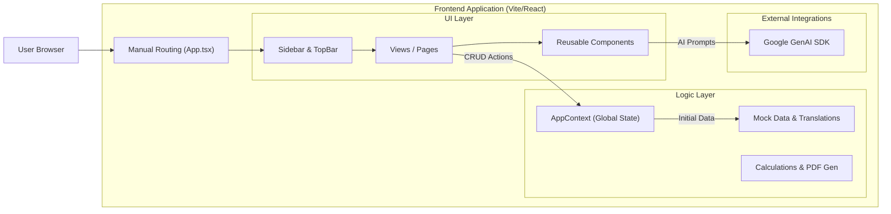

# AI Project Memory: SmartBiz Manager

**Last Updated:** 2024-05-23
**Project Type:** SaaS ERP / Business Management Platform (Frontend Prototype)
**Tech Stack:** React 19, TypeScript, Vite, Tailwind CSS, Lucide Icons, Recharts, Google GenAI SDK.

---

## 1. Project Overview

**SmartBiz Manager** is a single-page application (SPA) designed as a comprehensive ERP (Enterprise Resource Planning) system. It targets small to medium businesses requiring integrated management of CRM, Inventory, Sales, Purchasing, Services, Finance, and Fleet.

**Key Characteristics:**
*   **Architecture:** Client-side Monolith. Currently operates without a backend API; data is managed in React Context (`AppContext`) and initialized with mock data.
*   **Multi-Lingual:** Built-in support for LTR (English, French) and RTL (Arabic, Hebrew) layouts.
*   **Module-Based:** Distinct modules for different business functions, navigable via a sidebar.
*   **AI-Enhanced:** Integrates Google Gemini for a conversational business assistant.

**User Roles:**
*   Currently implicit **Admin** access (no granular permission system implemented yet).

---

## 2. Technical Architecture

The application follows a classic React SPA structure using Context API for global state management.

### High-Level Architecture

### Stack Details
*   **Build Tool:** Vite
*   **Framework:** React 19 (Functional Components, Hooks)
*   **Language:** TypeScript
*   **Styling:** Tailwind CSS (Dark mode support via `class` strategy)
*   **State Management:** `AppContext.tsx` (Centralized state for all domains)
*   **Routing:** Custom state-based routing in `App.tsx` (`currentView` state).
*   **I18n:** Custom JSON loader (`services/translations.ts`).

---

## 3. Domain & Modules Map

The ERP is divided into several high-level domains.

```mermaid
graph TD
    ERP[SmartBiz ERP]
    
    ERP --> CRM[CRM]
    ERP --> SRM[SRM]
    ERP --> IMM[Inventory]
    ERP --> SCM[Sales]
    ERP --> PCM[Purchasing]
    ERP --> FIN[Finance]
    ERP --> SRV[Services]
    ERP --> FLT[Fleet]
    ERP --> REP[Reporting]
    ERP --> SYS[Settings]

    CRM --> Clients
    SRM --> Suppliers
    
    IMM --> Products
    IMM --> Warehouses
    IMM --> Movements
    IMM --> Audit[Stock Audit]
    
    SCM --> Estimates
    SCM --> Orders
    SCM --> Deliveries
    SCM --> SalesInvoices
    SCM --> Returns[Customer Returns]
    
    PCM --> PR[Purchase Requests]
    PCM --> RFQ
    PCM --> PO[Purchase Orders]
    PCM --> GRN[Goods Receipt]
    PCM --> PurchInvoices
    PCM --> PurchReturns[Supplier Returns]
    
    FIN --> Banking
    FIN --> CashRegister
    FIN --> CostAnalysis
    
    SRV --> Jobs[Job Cards]
    SRV --> Techs[Technicians]

    FLT --> Vehicles
    FLT --> Missions
    FLT --> Maintenance
```

### Domain Details

1.  **CRM (Clients):**
    *   Manage customer profiles, contact info, and track total spend.
    *   **Fields:** Includes `taxId` (Matricule Fiscal) and `address`.
2.  **SRM (Suppliers):**
    *   Manage vendor profiles and procurement history.
3.  **Inventory (Stock):**
    *   **Multi-Warehouse:** Products track stock per warehouse (`warehouseStock`).
    *   **Movements:** Log of all ins/outs (`StockMovement`).
    *   **Valuation:** Weighted Average Cost (WAC) logic present in analysis.
    *   **Inventory Audit:** Complete module to control and adjust physical stock. Supports Partial/Full inventory, snapshot comparison, variance calculation, and commitment generating adjustment movements.
4.  **Sales:**
    *   Full cycle: Quote → Order → Delivery → Invoice.
    *   **Estimates (Devis):** Advanced editing capabilities including Draft mode, Status workflow (Draft->Sent->Accepted), and conversion to Order/Invoice.
    *   **Orders (Commande):** 
        *   Includes **Payment Terms** (e.g., Net 30) and **Payment Method** (e.g., Check) selection.
        *   **Validation Workflow:** Orders can be Validated (moving to 'Pending' status) and Reverted to Draft (allowing modification of items and details).
        *   **Draft Editing:** In Draft mode, users can add Products, Services, and Custom Items (non-existent in DB), as well as modify prices, quantities, and payment conditions.
        *   **Cancellation:** Validated orders can be cancelled.
        *   **Delivery Workflow:** 
            *   **Partial Delivery:** Create Delivery Notes for partial quantities via modal.
            *   **Auto Delivery (Deliver All):** One-click action to create a delivery note for all remaining items and complete the order.
    *   **Returns (Customer):** Manage returns from customers. Source document (Invoice/Delivery) required. Updates stock (reintegrate or quarantine).
    *   **Custom Items:** "L’ajout d’articles non existants dans la base permet de créer de nouveaux articles directement depuis le devis." (Adding non-existent items allows creating new items directly from the estimate).
    *   **Note:** "Issue Notes" (Bons de Sortie) module has been removed.
    *   **Printing:** Client Orders, Invoices, and Estimates PDF generation includes Client Name, Address, Phone, and Tax ID (Matricule Fiscal).
5.  **Purchasing:**
    *   Full cycle: PR (Internal) → RFQ → PO → Delivery (GRN) → Invoice.
    *   **Returns (Supplier):** Manage returns to suppliers. Source document (GRN/Invoice) required. Deducts stock.
6.  **Services:**
    *   Job Cards for repair/maintenance.
    *   Links Services (labor) and Products (parts).
    *   Technician management and scheduling status.
7.  **Finance:**
    *   **Banking:** Accounts, Transactions (Deposit, Withdrawal, Transfer).
    *   **Cash Register:** Shift-based cash management (Open/Close sessions).
8.  **Fleet Management:**
    *   **Vehicles**: Tracking of car make, model, license plate, fuel type, and status (Available, In Use, Maintenance).
    *   **Missions**: Assignment of drivers and vehicles to specific trips/dates.
    *   **Maintenance**: Logging of service/repairs and associated costs.
9.  **Settings:**
    *   Company profile, Logo, VAT/Tax rates, Currency, Fiscal Stamp configuration.

---

## 4. Data Model Summary

Key entities defined in `types.ts`:

| Entity | Key Fields | Notes |
| :--- | :--- | :--- |
| **Client** | `id`, `company`, `status`, `totalSpent`, `taxId`, `address` | Basic CRM entity with Matricule Fiscal. |
| **Product** | `id`, `sku`, `price`, `cost`, `stock`, `warehouseStock` | `warehouseStock` is a Record<WarehouseId, Quantity>. |
| **Invoice** | `id`, `type`, `status`, `items`, `amount`, `paymentTerms`, `paymentMethod` | **Polymorphic**: Handles Estimates, Orders, Deliveries, Invoices, and Returns based on `type`. Stores Payment info. |
| **Purchase** | `id`, `type`, `status`, `items`, `amount`, `linkedDocumentId` | **Polymorphic**: Handles PR, RFQ, Orders, Deliveries, Invoices, and Returns. |
| **StockMovement** | `id`, `productId`, `warehouseId`, `type`, `quantity` | Ledger for all stock changes. Types: `sale`, `purchase`, `transfer`, `return`, `adjustment`. |
| **InventorySession** | `id`, `reference`, `items` (array of `InventoryItem`), `status` | Represents a physical stock count session. |
| **ServiceJob** | `id`, `ticketNumber`, `status`, `services`, `usedParts` | Tracks repair jobs. Links to `ServiceItem` and `Product`. |
| **BankAccount** | `id`, `balance`, `currency` | Tracks liquid assets. |
| **CashSession** | `id`, `status`, `openingBalance`, `closingBalance` | Controls cash drawer shifts. |
| **Vehicle** | `id`, `plate`, `status`, `mileage`, `fuelType` | Fleet entity. |
| **FleetMission** | `id`, `vehicleId`, `driverName`, `startDate`, `endDate` | Tracks vehicle usage. |
| **FleetMaintenance** | `id`, `vehicleId`, `type`, `cost`, `date` | Tracks vehicle service history. |

**Important Enums/Types:**
*   `SalesDocumentType`: 'estimate' | 'order' | 'delivery' | 'invoice' | 'credit' | 'return'
*   `PurchaseDocumentType`: 'pr' | 'rfq' | 'order' | 'delivery' | 'invoice' | 'return'
*   `ServiceJobStatus`: 'pending' | 'in_progress' | 'completed' | 'invoiced'
*   `VehicleStatus`: 'available' | 'in_use' | 'maintenance' | 'out_of_service'

---

## 5. Application Flows

### Sales Workflow
1.  **Estimate (Optional):** Created in `SalesEstimates`. 
    *   **Draft Mode:** Editable (lines, custom items, payment terms).
    *   **Workflow:** `draft` (editable) -> `sent` (validated) -> `accepted` (final) -> Convert.
    *   **Custom Items:** Can add ad-hoc items that are not in the product database.
2.  **Order:** Created directly or converted from Estimate.
    *   **Terms:** Must select Payment Terms and Payment Method during creation.
    *   **Revert:** Can be reverted from 'Validated' (Pending) to 'Draft' to modify elements.
    *   **Cancel:** Orders can be cancelled after validation.
    *   **Delivery:** Create Delivery Notes for partial quantities or "Deliver All" to auto-complete.
3.  **Delivery:** Created from Order. **Action:** Deducts stock from specific warehouse via `addStockMovement`.
4.  **Invoice:** Created from Order or Delivery. Records revenue.
5.  **Payment:** Recorded against Invoice. Updates `amountPaid` and creates `BankTransaction` or `CashTransaction`.
6.  **Return:** Created from Invoice/Delivery/Order. **Action:** Increases stock (if reintegrated).

### Purchase Workflow
1.  **PR (Internal):** Staff requests items.
2.  **RFQ:** Sent to suppliers.
3.  **Purchase Order:** Confirmed agreement.
4.  **Goods Receipt (GRN):** **Action:** Increases stock in specific warehouse. Updates WAC (Weighted Average Cost).
5.  **Bill/Invoice:** Records expense.
6.  **Return:** Created from Purchase Invoice/GRN. **Action:** Decreases stock.

### Inventory Audit Workflow
1.  **Create Session:** Select warehouse and category filter. System snapshots current "theoretical" stock.
2.  **Count:** User enters physical quantities. System highlights variance in real-time.
3.  **Save:** Progress can be saved without committing.
4.  **Commit:** System finalizes the session. **Action:** Creates `StockMovement` records (type: `adjustment`) for all items where `variance != 0` to bring system stock in line with physical stock.
5.  **Report:** Printable report available for completed sessions.

### Service Workflow
1.  **Job Card:** Created with customer & device info.
2.  **Diagnosis/Work:** Technician adds `Services` (Labor) and `Products` (Parts) to the job.
3.  **Completion:** Job status set to `completed`.
4.  **Invoicing:** Job converted to `Invoice`. Parts deducted from inventory.

---

## 6. Configuration & Settings

*   **Global Settings (`AppSettings`):**
    *   Stored in `AppContext`.
    *   **Currency:** Configurable symbol/code.
    *   **Tax:** List of `TaxRate` objects (e.g., VAT 19%).
    *   **Fiscal Stamp:** Toggle and value.
    *   **Localization:** Language (en, fr, ar, etc.) triggers RTL/LTR.
    *   **Gemini API Key:** User-provided key for AI features.

---

## 7. Security, Permissions & Error Handling

*   **Auth:** No authentication system implementation found. The app assumes an authenticated context or single-user mode.
*   **Permissions:** No role-based access control (RBAC). All modules are accessible.
*   **Error Handling:** Basic `console.error` and alert dialogs. `AIAssistant` has specific error handling for API keys.

---

## 8. Current Limitations & Technical Debt

1.  **Persistence:** **CRITICAL**. Data resides solely in React Memory. Refreshing the browser resets all data to `mockData.ts`.
2.  **Routing:** Manual `useState` routing prevents deep linking and browser history navigation (Back button doesn't work as expected).
3.  **Performance:** `AppContext` contains ALL data and methods. This will cause re-renders of the entire app on small changes as the dataset grows.
4.  **Validation:** Input validation is minimal (mostly HTML5 attributes).
5.  **Type Safety:** Heavy use of `any` in some complex transformations (e.g., `Purchases.tsx` cart handling).

---

## 9. TODO / Roadmap

*   **Persistence:** Implement `localStorage` or IndexedDB adapter in `AppContext` to survive refreshes.
*   **Refactor Routing:** Migrate to `react-router-dom` for better navigation UX.
*   **State Management:** Split `AppContext` into domain-specific contexts (e.g., `SalesContext`, `InventoryContext`) or use Redux/Zustand.
*   **Validation:** Integrate `zod` or `react-hook-form`.
*   **Dashboard:** Connect `Dashboard.tsx` charts to real context data (currently some charts might be static or partially mocked).

---

## 10. Diagrams Index

*   **Architecture:** Section 2 (Mermaid Flowchart).
*   **Domain Map:** Section 3 (Mermaid Graph).

---

## 11. Last Update

**Timestamp:** 2024-05-23
**Changelog:**
*   Fixed Mermaid syntax error in architecture diagram by adding quotes to node labels.
*   Initial deep scan and creation of structure `AI_MEMORY.md`.
*   Mapped all modules and key entity relationships.
*   Identified polymorphic nature of `Invoice` and `Purchase` types.
*   Documented the critical lack of persistence.
*   **Sales Estimates Update:** Added details about Edit mode, Validation workflow, and Custom Items.
*   Added business rule: "L’ajout d’articles non existants dans la base permet de créer de nouveaux articles directement depuis le devis."
*   **Sales Orders Update:** Added Payment Terms and Payment Method to creation flow and details view.
*   **Sales Orders Workflow:** Added Validation (Draft->Pending) and Revert to Draft (Pending->Draft) with inline editing capabilities.
*   **Sales Orders Editing:** Added support for adding Services and Custom Items (text/price) in Draft mode.
*   **Sales Orders Cancellation:** Confirmed "Cancel Order" functionality for validated orders.
*   **Sales Orders Delivery:** Added Partial/Full delivery functionality and "Deliver All" auto-creation.
*   **Returns Module:** Implemented Returns for Customers and Suppliers. Removed Issue Notes module.
*   **Client Update:** Added `taxId` (Matricule Fiscal) field to Client entity.
*   **PDF Update:** Added Client Name, Address, Phone, and Tax ID to Estimate, Order, and Invoice PDFs.
*   **Inventory Audit:** Added `InventoryAudit` module for stocktaking and adjustments, including printing support.
*   **Fleet Management:** Added comprehensive module for managing vehicles, missions, and maintenance.
