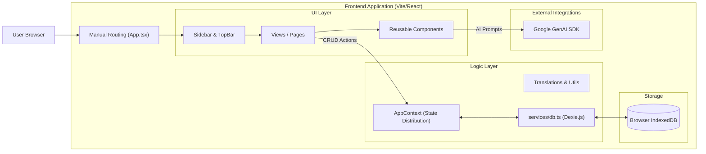

# AI Project Memory: SmartBiz Manager

**Last Updated:** 2024-05-24
**Project Type:** SaaS ERP / Business Management Platform (Frontend Prototype)
**Tech Stack:** React 19, TypeScript, Vite, Tailwind CSS, Lucide Icons, Recharts, Google GenAI SDK, **Dexie.js (IndexedDB)**.

---

## 1. Project Overview

**SmartBiz Manager** is a single-page application (SPA) designed as a comprehensive ERP (Enterprise Resource Planning) system. It targets small to medium businesses requiring integrated management of CRM, Inventory, Sales, Purchasing, Services, Finance, Fleet, and HR.

**Key Characteristics:**
*   **Architecture:** Client-side Monolith with **Local Persistence**. Data is stored in the browser's IndexedDB via Dexie.js, ensuring data survives page refreshes.
*   **Context:** Pre-configured with a **Tunisian Business Context** (TND currency, local cities, tax IDs, specific industry examples).
*   **Multi-Lingual:** Built-in support for LTR (English, French) and RTL (Arabic, Hebrew) layouts.
*   **Module-Based:** Distinct modules for different business functions, navigable via a sidebar.
*   **AI-Enhanced:** Integrates Google Gemini for a conversational business assistant.

**User Roles:**
*   Currently implicit **Admin** access (no granular permission system implemented yet).

---

## 2. Technical Architecture

The application uses React Context for state distribution and Dexie.js for persistent storage.

### High-Level Architecture

### Stack Details
*   **Build Tool:** Vite
*   **Framework:** React 19 (Functional Components, Hooks)
*   **Language:** TypeScript
*   **Styling:** Tailwind CSS (Dark mode support via `class` strategy)
*   **State Management:** `AppContext.tsx` acts as the bridge between UI and Database.
*   **Persistence:** `Dexie.js` wrapper for IndexedDB. Data is seeded on first load (`services/mockData.ts`).
*   **Routing:** Custom state-based routing in `App.tsx` (`currentView` state).
*   **I18n:** Custom JSON loader (`services/translations.ts`).

---

## 3. Domain & Modules Map

The ERP is divided into several high-level domains.

```mermaid
graph TD
    ERP[SmartBiz ERP]
    
    ERP --> CRM[CRM]
    ERP --> SRM[SRM]
    ERP --> IMM[Inventory]
    ERP --> SCM[Sales]
    ERP --> PCM[Purchasing]
    ERP --> FIN[Finance]
    ERP --> SRV[Services]
    ERP --> FLT[Fleet]
    ERP --> HR[Human Resources]
    ERP --> REP[Reporting]
    ERP --> SYS[Settings]

    CRM --> Clients
    SRM --> Suppliers
    
    IMM --> Products
    IMM --> Warehouses
    IMM --> Movements
    IMM --> Audit[Stock Audit]
    
    SCM --> Estimates
    SCM --> Orders
    SCM --> Deliveries
    SCM --> SalesInvoices
    SCM --> Returns[Customer Returns]
    
    PCM --> PR[Purchase Requests]
    PCM --> RFQ
    PCM --> PO[Purchase Orders]
    PCM --> GRN[Goods Receipt]
    PCM --> PurchInvoices
    PCM --> PurchReturns[Supplier Returns]
    
    FIN --> Banking
    FIN --> CashRegister
    FIN --> CostAnalysis
    
    SRV --> Jobs[Job Cards]
    SRV --> Techs[Technicians]
    SRV --> Maint[Maintenance CRM]

    FLT --> Vehicles
    FLT --> Missions
    FLT --> Maintenance

    HR --> Employees
    HR --> Contracts
    HR --> Payroll
    HR --> Leave
    HR --> Expenses
```

### Domain Details (Updates)

1.  **Services & Maintenance:**
    *   **Job Cards:** Track repair jobs linking Services and Parts.
    *   **Maintenance CRM:** New module (`MaintenanceCRM.tsx`) for tracking long-term maintenance contracts, recurring visits, and client interaction history (Calls, Meetings).
2.  **Inventory (Stock):**
    *   **Audit:** Full cycle audit with variance calculation and automatic adjustment creation.
3.  **Finance:**
    *   **Banking:** Accounts, Transactions.
    *   **Cash Register:** Shift-based cash management.
4.  **HR:**
    *   Employee profiles, Contracts, Payroll generation, Leave requests, and Expense reports.

---

## 4. Data Model Summary

Key entities defined in `types.ts` and persisted in `SmartBizDatabase`:

| Entity | Key Fields | Notes |
| :--- | :--- | :--- |
| **Client** | `id`, `company`, `status`, `totalSpent`, `taxId` | Includes Tunisian specific fields (Matricule Fiscal). |
| **Product** | `id`, `sku`, `price`, `cost`, `stock`, `warehouseStock` | `warehouseStock` is a Record<WarehouseId, Quantity>. |
| **Invoice** | `id`, `type`, `status`, `items`, `amount`, `paymentTerms` | Polymorphic: Estimates, Orders, Deliveries, Invoices, Returns. |
| **Purchase** | `id`, `type`, `status`, `items`, `amount`, `linkedDocumentId` | Polymorphic: PR, RFQ, Orders, Deliveries, Invoices, Returns. |
| **StockMovement** | `id`, `productId`, `warehouseId`, `type`, `quantity` | Ledger for all stock changes. |
| **MaintenanceContract** | `id`, `clientId`, `type`, `startDate`, `endDate` | Tracks recurring service agreements. |
| **ContactInteraction** | `id`, `clientId`, `type`, `summary` | Tracks CRM history (calls, emails). |
| **Vehicle** | `id`, `plate`, `status`, `mileage` | Fleet entity. |
| **Employee** | `id`, `firstName`, `lastName`, `department`, `salary` | HR entity. |
| **Payroll** | `id`, `employeeId`, `month`, `netSalary` | Salary processing records. |

---

## 5. Application Flows

### Persistence Workflow
1.  **App Start:** `AppContext` initializes. Calls `seedDatabase` in `services/db.ts`.
2.  **Seeding:** If DB is empty, populates with `mockData.ts` (Tunisian dataset).
3.  **Loading:** `AppContext` fetches all tables from IndexedDB into local state variables.
4.  **CRUD:**
    *   UI calls Context function (e.g., `addClient`).
    *   Context updates IndexedDB (`await db.clients.add(...)`).
    *   Context updates local React state to reflect change immediately (Optimistic UI).

### Maintenance Workflow
1.  **Contract:** Create a maintenance contract for a client (Preventive/Corrective).
2.  **Monitoring:** Dashboard shows expiring contracts and upcoming interventions.
3.  **Intervention:** Create `ServiceJob` linked to client.
4.  **History:** Log calls/emails in `ContactInteraction`.

---

## 6. Configuration & Settings

*   **Global Settings (`AppSettings`):**
    *   Stored in `settings` table in IndexedDB (ID: 'config').
    *   **Localization:** Tuned for Tunisian market (TND Currency, French/Arabic support).
    *   **AI:** Gemini API Key stored here.

---

## 7. Security, Permissions & Error Handling

*   **Auth:** No authentication system implementation found.
*   **Permissions:** No role-based access control (RBAC).
*   **Error Handling:** Basic alerts. `db.ts` has basic try/catch for loading.

---

## 8. Current Limitations & Technical Debt

1.  **Performance:** `AppContext` loads *entire tables* into memory on startup. This is fine for a prototype (< few thousand records) but will not scale for production with large datasets. Pagination should be moved to the DB query level.
2.  **Routing:** Manual `useState` routing prevents deep linking.
3.  **Relations:** No foreign key constraints in IndexedDB. Logic relies on application-level integrity.
4.  **Sync:** Data is local to the specific browser/device. No cloud sync.

---

## 9. TODO / Roadmap

*   **Refactor Routing:** Migrate to `react-router-dom`.
*   **Optimized Data Loading:** Implement pagination/filtering at the Dexie.js level instead of loading all data into React state.
*   **Validation:** Integrate `zod` for form validation.
*   **Backup/Restore:** Add functionality to export/import the IndexedDB data as JSON file.

---

## 10. Diagrams Index

*   **Architecture:** Section 2 (Mermaid Flowchart).
*   **Domain Map:** Section 3 (Mermaid Graph).

---

## 11. Last Update

**Timestamp:** 2024-05-24
**Changelog:**
*   **Persistence Layer:** Implemented `Dexie.js` (IndexedDB) replacing in-memory storage.
*   **Data Context:** Updated mock data to represent a comprehensive **Tunisian** business context (SFBT, Poulina, TND currency, etc.).
*   **Maintenance Module:** Added `MaintenanceCRM.tsx` for contract and interaction management.
*   **HR & Fleet:** Confirmed integration of HR and Fleet management modules into the core data structure.
*   **Bug Fixes:** Resolved TypeScript typing issues with Dexie library.
